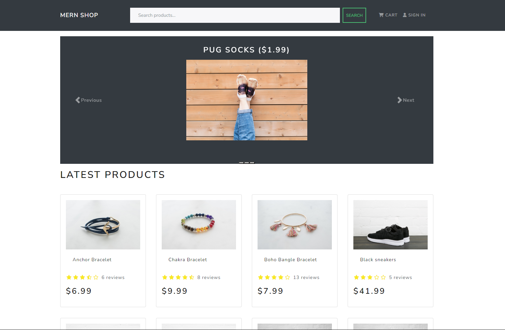

# E-commerce site built with the MERN stack

[Visit the web page deployed on ](https://react-e-commerce-test-site.onrender.com)
[](https://react-e-commerce-test-site.onrender.com)



## Default user for testing

```
Test user name: john@example.com
Test user password: 123456
```

---

## Run the app

### Run frontend and backend

```
npm run dev
```

### Run backend only

```
npm run server
```

## Import default data to database

### Import data to database

```
npm run data:import
```

### Delete all data in database

```
npm run data:destroy
```
